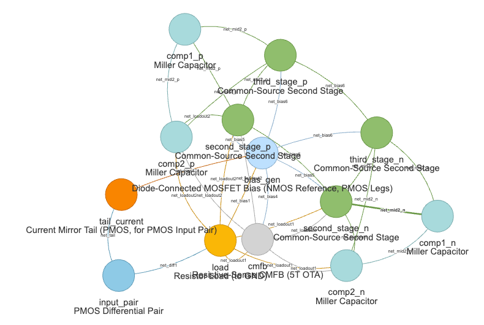

# CircuitGenome

A Python toolkit for analog circuit topology synthesis and recognition, focused on op-amp design.

## Modules

### 1. Topology Synthesizer *(available)*
Constructs complete op-amp circuits from modular building blocks. Given a topology configuration (number of stages, output type), it enumerates every valid combination of module variants and emits SPICE netlists.

### 2. Subcircuit Recognizer *(available, MVP)*
Takes a flat SPICE netlist and identifies structural subcircuits (differential pairs, current mirrors, cascode loads, bias generators, CMFB circuits, compensation networks, second-stage amplifiers, etc.) via a YAML pattern library. The library covers 34 patterns across seven categories (input pair, load, tail current, bias generation, CMFB, compensation, second stage), spanning all seven topologies from `one_stage_opamp` through the four 3-stage NMC/RNMC variants.

### 3. Functional Block Recognizer *(available, MVP)*
Takes the Subcircuit Recognizer's output plus a topology template and assigns each recognized structure to its functional slot (input stage, load, tail current, bias generation, etc.), recovering the original `variant_map`.

---

## Installation

```bash
pip install circuitgenome
```

Or install from source:

```bash
pip install -e .
```

Requires Python 3.9+ and PyYAML.

---

## Topology Synthesizer

The synthesizer works by combining **module variants** according to a **topology template**. Each module category has a fixed port interface; variants differ only in their internal implementation.

### Module categories

| Category | Variants |
|---|---|
| Input pair | PMOS/NMOS differential pair, with/without source degeneration, inverter-based |
| Load | Resistor (VDD-side / GND-side), PMOS/NMOS active (current mirror), PMOS/NMOS current source, folded cascode (PMOS/NMOS-input, single-output & differential-output), telescopic cascode (PMOS/NMOS) |
| Tail current | Current mirror (PMOS/NMOS), cascode current mirror (PMOS/NMOS), resistor (VDD-side / GND-side) |
| Bias generation | Diode-connected MOSFET ladder, magic battery (current mirror), resistor ladder |
| CMFB | Resistive-sense 5T OTA, differential-difference amplifier (DDA) — present only when `load` has a differential-output cascode (`output_cardinality: "differential"`) |
| Compensation | Miller cap, Miller cap + nulling resistor, indirect |
| Second stage | Common-source, common-drain (source follower), differential OTA |

**Input pair**


**Load**


**Tail current**


**Bias generation**


**CMFB**


### Topology templates

| Name | Stages | Output | Compensation |
|---|---|---|---|
| `one_stage_opamp` | 1 | Single-ended | — |
| `two_stage_opamp_single_ended` | 2 | Single-ended | — |
| `two_stage_opamp_fully_differential` | 2 | Fully differential | — |
| `three_stage_opamp_nmc_single_ended` | 3 | Single-ended | Nested Miller (NMC) |
| `three_stage_opamp_rnmc_single_ended` | 3 | Single-ended | Reversed Nested Miller (RNMC) |
| `three_stage_opamp_nmc_fully_differential` | 3 | Fully differential | Nested Miller (NMC) |
| `three_stage_opamp_rnmc_fully_differential` | 3 | Fully differential | Reversed Nested Miller (RNMC) |

Of the 5 × 12 × 6 = 360 possible `input_pair` / `load` / `tail_current`
combinations, only 144 have compatible PMOS/NMOS polarities (see "Polarity
compatibility filter" below) — the rest are filtered out by
`enumerate_circuits`. Of those 144, 72 use `inverter_based_input`, whose
self-biased design never references its `tail` port: the "Tail-current
compatibility filter" below collapses those 72 combinations' 6
`tail_current` choices down to 1 canonical choice (72 -> 12), leaving **84**
effective combinations (the 72 combinations using a `differential_pair_*`
variant are unaffected). Of those 84, the "Output-cardinality compatibility
filter" below further splits them by which output type the `load` supports:
**70** are valid for single-ended topologies and **56** are valid for
fully-differential topologies. A 1-stage topology therefore yields
**210 unique circuits** (70 × 3). A 2-stage single-ended topology yields
**1890 circuits** (70 × 3 × 3 × 3); a 2-stage fully-differential topology
also has a `cmfb` slot, but (per the "CMFB compatibility filter" below) only
the 14-of-56 combinations using a `"differential"`-cardinality `load` keep
both `cmfb` variants -- 28 + 42 = 70 effective load/cmfb combinations, so it
yields **17 010 circuits** (70 × 3⁵). Each 3-stage single-ended topology adds
two more `second_stage` slots (gm2, gm3) and two `compensation` slots (Cm1,
Cm2), yielding **17 010 circuits** (70 × 3⁵). Each 3-stage
fully-differential topology duplicates those four slots per output path
(keeping the single `cmfb` slot), yielding **1 377 810 circuits** (70 × 3⁹).

### Polarity compatibility filter

A circuit only has a real DC current path if its `input_pair`, `load`, and
`tail_current` agree on polarity. For example, `differential_pair_nmos`
draws current out of `out1`/`out2` into the tail, so it needs a `load` that
*sources* current into `out1`/`out2` from vdd and a `tail_current` that
*sinks* the tail node to gnd — pairing it with `active_load_nmos` (which also
sinks to gnd) or `current_mirror_tail_pmos` (which also sources into the
tail) leaves a node with no current path.

Each `input_pair`, `load`, and `tail_current` variant declares a `polarity`
field in `opamp_modules.yaml`: `pmos_input`, `nmos_input`, or omitted for
variants that work with either (`inverter_based_input`, and currently all
`bias_generation` variants). `enumerate_circuits` skips any combination where
`load`/`tail_current`'s `polarity` (if set) doesn't match `input_pair`'s. To
extend the filter to a new or edited variant, just add the matching
`polarity:` tag in YAML — no code changes needed
(`circuitgenome/synthesizer/polarity_compatibility.py`).

### Output-cardinality compatibility filter

`load.in1`/`in2` (the folding nodes fed by `input_pair.out1`/`out2`) and
`load.out`/`out1`/`out2` (the load's actual output node(s)) are wired to
*separate* nets by every topology. Whether the output-side ports get a net at
all depends on the topology's `output_type`: `load.out1`/`out2` are wired to
`net_loadout1`/`net_loadout2` only in `fully_differential` topologies (sensed
by `cmfb`/`second_stage*`/`comp*`), and `load.out`/`out2` are wired to the
stage's output node only in `single_ended` topologies.

Folded-cascode/telescopic-cascode loads with a single output
(`folded_cascode_load_*_input_single_output`,
`telescopic_cascode_load_{pmos,nmos}`) declare `out` as mandatory, so they'd
be left floating in a `fully_differential` topology. Folded-cascode loads
with differential outputs (`folded_cascode_load_*_input_differential_output`)
declare `out1`/`out2` as mandatory cascode-output nodes, so they'd be left
floating in a `single_ended` topology (where `net_loadout1`/`net_loadout2`
aren't defined).

These 6 `load` variants declare an `output_cardinality` field in
`opamp_modules.yaml`: `"single"` (compatible only with `single_ended`) or
`"differential"` (compatible only with `fully_differential`); the other 6
`load` variants (resistor/active/current-source) declare `out1`/`out2` as
`alias_of: in1`/`in2` — a net-merge pass (`net_aliasing.py`) collapses their
`out1`/`out2` net back onto `in1`/`in2`'s after assembly, restoring a single
shared in/out node regardless of `output_type`. They're untagged and
compatible with either. `enumerate_circuits` skips any combination where
`load`'s `output_cardinality` (if set) doesn't match the topology's
`output_type`. To extend the filter to a new or edited `load` variant, just
add the matching `output_cardinality:` tag in YAML — no code changes needed
(`circuitgenome/synthesizer/output_compatibility.py`).

### CMFB compatibility filter

`fully_differential` topologies have a `cmfb` slot, wired
`cmfb.out -> net_cmfb_out -> load.bias_cmfb`. Of the 12 `load` variants, only
the 2 tagged `output_cardinality: "differential"`
(`folded_cascode_load_*_input_differential_output`) declare `bias_cmfb` as a
real consumer (gating `mn3`/`mn4` or `mp1`/`mp2`); the other 10 declare it
`optional` and never reference it, so `net_cmfb_out` would drive nothing.

For a `load` whose `output_cardinality` isn't `"differential"`,
`enumerate_circuits` only allows the canonical `resistive_sense_cmfb` variant
through (avoiding a duplicate-circuit enumeration of `dda_cmfb`), then prunes
it to an empty placeholder — it contributes no devices, `cmfb.bias` is no
longer a needed bias rail, and the `vcm_ref` external port is left
unconnected for these circuits. To extend: tag a new or edited `load` variant
with `output_cardinality: "differential"` (and give it a real `bias_cmfb`
consumer) to make it a genuine `cmfb` consumer — no code changes needed
(`circuitgenome/synthesizer/cmfb_compatibility.py`).

### Tail-current compatibility filter

Every topology has a `tail_current` slot, wired `input_pair.tail ->
net_tail <- tail_current.out`. Of the 5 `input_pair` variants, only the 4
`differential_pair_*` variants reference their `tail` port from a device
terminal; `inverter_based_input` — two back-to-back CMOS inverters — is
self-biased by design and never references `tail`, so without this filter
`net_tail` would be a floating, single-terminal node and `tail_current` would
drive nothing.

For an `input_pair` that doesn't reference `tail`, `enumerate_circuits` only
allows the canonical `current_mirror_tail_pmos` variant through (avoiding a
duplicate-circuit enumeration of the other 5 `tail_current` variants), then
prunes it to an empty placeholder — it contributes no devices, `net_tail` is
no longer floating, and `tail_current.bias` is no longer a needed bias rail.
To extend: wire a new or edited `input_pair` variant's tail-side device
terminal(s) to `tail` to make it a genuine `tail_current` consumer — no code
changes needed (`circuitgenome/synthesizer/tail_current_compatibility.py`).

### Three-stage compensation schemes

Both 3-stage templates reuse the existing `second_stage` modules for the
second (gm2) and third (gm3) gain stages, and the existing `compensation`
modules for the two Miller capacitors Cm1/Cm2 — no new module variants are
required.

- **Nested Miller (NMC)** — both Cm1 and Cm2 return to the final output node:
  Cm1 spans gm2+gm3 (outer loop), Cm2 spans gm3 only (inner loop).
- **Reversed Nested Miller (RNMC)** — Cm1 spans gm3 only (gm2's output to the
  final output), while Cm2 spans gm2 only (gm1's output to gm2's output)
  instead of returning to the final output. This reduces output-node loading,
  which is useful when gm3 is a low-gain buffer.

---

## CLI Usage

### List available topologies

```bash
circuitgenome synthesize --list-topologies
```

```
  one_stage_opamp  (stages=1, output=single_ended)
  two_stage_opamp_single_ended  (stages=2, output=single_ended)
  two_stage_opamp_fully_differential  (stages=2, output=fully_differential)
  three_stage_opamp_nmc_single_ended  (stages=3, output=single_ended, compensation=nested_miller)
  three_stage_opamp_rnmc_single_ended  (stages=3, output=single_ended, compensation=reversed_nested_miller)
  three_stage_opamp_nmc_fully_differential  (stages=3, output=fully_differential, compensation=nested_miller)
  three_stage_opamp_rnmc_fully_differential  (stages=3, output=fully_differential, compensation=reversed_nested_miller)
```

### List available module variants

```bash
circuitgenome synthesize --list-modules
```

### Generate circuits

```bash
# All 1-stage single-ended variants, flat SPICE
circuitgenome synthesize --stages 1 --output-dir ./circuits/

# All 2-stage single-ended variants, both flat and hierarchical SPICE
circuitgenome synthesize --stages 2 --output-type single_ended --format both --output-dir ./circuits/

# Dry run — count circuits without writing files
circuitgenome synthesize --stages 2 --dry-run

# Specific topology by name
circuitgenome synthesize --topology two_stage_opamp_fully_differential --output-dir ./circuits/

# 3-stage, nested Miller compensation, single-ended
circuitgenome synthesize --topology three_stage_opamp_nmc_single_ended --output-dir ./circuits/

# Dry run — count all 3-stage variants (NMC + RNMC, single-ended + fully differential)
circuitgenome synthesize --stages 3 --dry-run
```

### Visualize topologies

```bash
circuitgenome visualize
```

Launches a Streamlit web UI for browsing topologies and module variants: pick
a topology, swap each slot's module variant, and see the resulting block
diagram (and SPICE netlist, for valid combinations) update live. Requires the
`viz` extra:

```bash
pip install circuitgenome[viz]
```



#### CLI options

| Flag | Description | Default |
|---|---|---|
| `--stages 1\|2\|3` | Filter by number of stages | all |
| `--output-type single_ended\|fully_differential` | Filter by output type | all |
| `--topology NAME` | Use one specific topology | all |
| `--format flat\|hierarchical\|both` | SPICE output format | `flat` |
| `--output-dir PATH` | Directory for output files | `.` |
| `--dry-run` | Count circuits without writing | off |
| `--list-topologies` | Print topology names and exit | — |
| `--list-modules` | Print module variants and exit | — |

### Output format

Each generated circuit gets its own `.ckt` file. For `--format both`, two files are written per circuit:

**Flat SPICE** (`circuit_0001_flat.ckt`) — all devices in a single `.subckt` block:

```spice
.subckt circuit_0001 ibias in1 in2 out vdd! gnd!
m1_input_pair net_diff1 in1 net_tail net_tail pmos
m2_input_pair net_mid in2 net_tail net_tail pmos
r1_load net_diff1 gnd! 1k
r2_load net_mid gnd! 1k
m1_tail_current net_bias7 net_bias7 vdd! vdd! pmos
m2_tail_current net_tail net_bias7 vdd! vdd! pmos
mn1_bias_gen ibias ibias gnd! gnd! nmos
mn6_bias_gen net_bias5 ibias gnd! gnd! nmos
mp5_bias_gen net_bias5 net_bias5 vdd! vdd! pmos
mn8_bias_gen net_bias7 ibias gnd! gnd! nmos
mp7_bias_gen net_bias7 net_bias7 vdd! vdd! pmos
c1_compensation net_mid out 1p
mn1_second_stage out net_mid gnd! gnd! nmos
mp1_second_stage out net_bias5 vdd! vdd! pmos
.ends
```

**Hierarchical SPICE** (`circuit_0001_hier.ckt`) — one `.subckt` per module, top-level uses `X` instances:

```spice
.subckt differential_pair_pmos in1 in2 out1 out2 tail vdd gnd
m1 out1 in1 tail tail pmos
m2 out2 in2 tail tail pmos
.ends

.subckt resistor_load_gnd in1 in2 out1 out2 vdd gnd
r1 in1 gnd 1k
r2 in2 gnd 1k
.ends

.subckt current_mirror_tail_pmos out bias vdd gnd
m1 bias bias vdd vdd pmos
m2 out bias vdd vdd pmos
.ends

.subckt diode_connected_mosfet_bias ibias out5 out7 vdd gnd
mn1 ibias ibias gnd gnd nmos
mn6 out5 ibias gnd gnd nmos
mp5 out5 out5 vdd vdd pmos
mn8 out7 ibias gnd gnd nmos
mp7 out7 out7 vdd vdd pmos
.ends

.subckt miller_cap in out
c1 in out 1p
.ends

.subckt common_source in out bias vdd gnd
mn1 out in gnd gnd nmos
mp1 out bias vdd vdd pmos
.ends

.subckt circuit_0001 ibias in1 in2 out vdd! gnd!
Xinput_pair in1 in2 net_diff1 net_mid net_tail vdd! gnd! differential_pair_pmos
Xload net_diff1 net_mid net_diff1 net_mid vdd! gnd! resistor_load_gnd
Xtail_current net_tail net_bias7 vdd! gnd! current_mirror_tail_pmos
Xbias_gen ibias net_bias5 net_bias7 vdd! gnd! diode_connected_mosfet_bias
Xcompensation net_mid out miller_cap
Xsecond_stage net_mid out net_bias5 vdd! gnd! common_source
.ends
```

---

## Python API

```python
from circuitgenome import synthesize
from circuitgenome.synthesizer import to_flat_spice, to_hierarchical_spice

# Generate all 2-stage single-ended circuits
circuits = synthesize({"stages": 2, "output_type": "single_ended"})
print(f"{len(circuits)} circuits generated")

# Inspect the first circuit
c = circuits[0]
print(c.topology)          # "two_stage_opamp_single_ended"
print(c.variant_map)       # {"input_pair": <ModuleVariant>, "load": <ModuleVariant>, ...}

# Serialize to SPICE
flat = to_flat_spice(c, name="my_opamp")
hier = to_hierarchical_spice(c, name="my_opamp")

# Use a specific topology by name
circuits = synthesize({"topology": "one_stage_opamp"})

# All 3-stage single-ended circuits using Reversed Nested Miller Compensation
circuits = synthesize({
    "stages": 3,
    "output_type": "single_ended",
    "compensation_scheme": "reversed_nested_miller",
})

# Load custom module/topology definitions
from circuitgenome.synthesizer.loader import load_modules, load_topologies
from circuitgenome.synthesizer import enumerate_circuits

modules = load_modules("path/to/my_modules.yaml")
topologies = load_topologies("path/to/my_topologies.yaml")
for circuit in enumerate_circuits(topologies[0], modules):
    print(to_flat_spice(circuit))
```

---

## Extending with custom modules

Add new variants to `circuitgenome/synthesizer/config/opamp_modules.yaml`:

```yaml
- name: my_custom_input_pair
  category: input_pair
  display_name: "My Custom Input Pair"
  ports:
    - {name: in1,  role: input}
    - {name: in2,  role: input}
    - {name: out1, role: output}
    - {name: out2, role: output}
    - {name: tail, role: supply_in}
    - {name: vdd,  role: supply}
    - {name: gnd,  role: supply}
  devices:
    - {ref: m1, type: pmos, d: out1, g: in1, s: tail, b: tail}
    - {ref: m2, type: pmos, d: out2, g: in2, s: tail, b: tail}
    - {ref: m3, type: nmos, d: out1, g: in1, s: gnd,  b: gnd}
    - {ref: m4, type: nmos, d: out2, g: in2, s: gnd,  b: gnd}
```

The new variant is picked up automatically — no code changes needed.

---

## Running tests

```bash
python3 -m pytest tests/ -v
```

---

## References

- *A Data-Driven Analog Circuit Synthesizer with Automatic Topology Selection and Sizing*
- *FUBOCO: Structure Synthesis of Basic Op-Amps by FUnctional BlOck COmposition*
- *A Functional Block Decomposition Method for Automatic Op-Amp Design*
