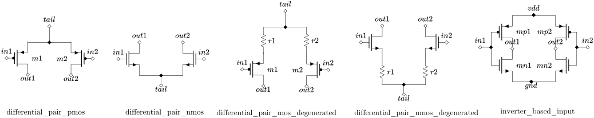
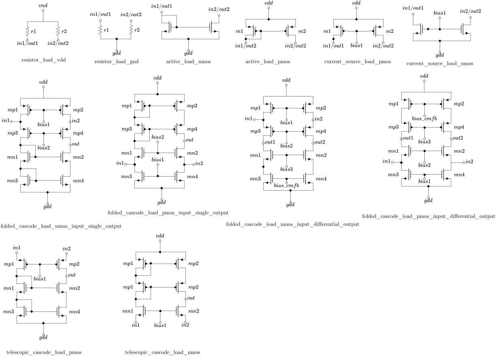
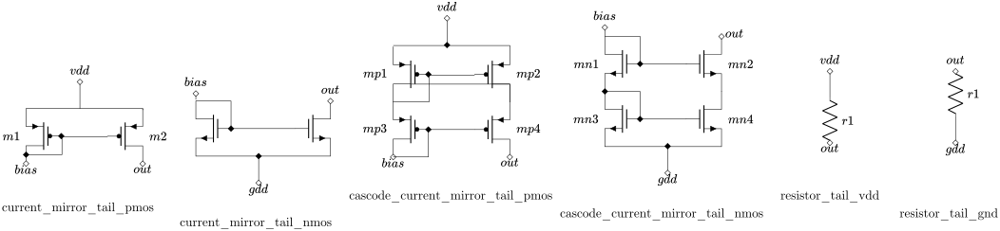
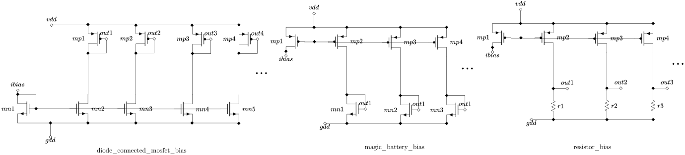
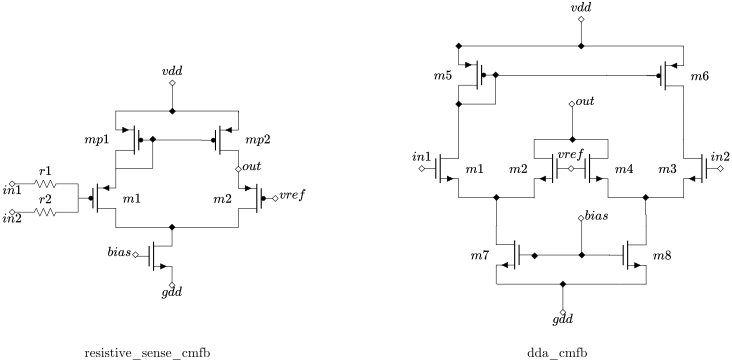

Overview
========

CircuitGenome is structured around three modules, each addressing a different
direction of the analog circuit design problem.

.. list-table::
   :header-rows: 1
   :widths: 30 15 55

   * - Module
     - Status
     - Description
   * - Topology Synthesizer
     - Available
     - Constructs op-amp circuits from modular building blocks and emits
       SPICE netlists.
   * - Subcircuit Recognizer
     - Available (MVP)
     - Identifies structural subcircuits (differential pairs, cascode
       mirrors, etc.) in a flat SPICE netlist.
   * - Functional Block Recognizer
     - Available (MVP)
     - Identifies the functional role of each part of a flat SPICE netlist
       (input stage, load, bias generation, etc.).

Topology Synthesizer
--------------------

The synthesizer models an op-amp as a composition of **module slots**.  Each
slot is filled by one **module variant** — a concrete circuit implementation
of a functional category.  The synthesizer iterates over all valid
combinations and wires them together according to a **topology template**.

Module categories
~~~~~~~~~~~~~~~~~

.. list-table::
   :header-rows: 1
   :widths: 25 75

   * - Category
     - Variants
   * - Input pair
     - PMOS differential pair, NMOS differential pair, PMOS with source
       degeneration, NMOS with source degeneration, inverter-based
   * - Load
     - Resistor (VDD-side / GND-side), PMOS active (current mirror), NMOS
       active (current mirror), PMOS/NMOS current source, folded cascode
       (PMOS/NMOS-input, single-output & differential-output), telescopic
       cascode (PMOS/NMOS)
   * - Tail current
     - Current mirror (PMOS/NMOS), cascode current mirror (PMOS/NMOS),
       resistor (VDD-side / GND-side)
   * - Bias generation
     - Diode-connected MOSFET legs, magic battery current mirror, resistor
       legs (all three: shared ibias reference + seven independent mirror
       legs -- rails 1-4 for ``load``, rail 5 for ``second_stage``, rail 6
       for ``third_stage``, rail 7 for ``tail_current``)
   * - CMFB
     - Resistive-sense 5T OTA, differential-difference amplifier (DDA) --
       senses the load's first-stage differential outputs
       (``net_diff1``/``net_diff2``) against an external ``vcm_ref`` and
       drives the differential-output cascode load's ``bias_cmfb`` input.
       Present only when ``load``'s ``output_cardinality`` is
       ``"differential"``; otherwise pruned to an empty placeholder (see
       "CMFB compatibility filter" below) and ``vcm_ref`` is left
       unconnected.
   * - Compensation
     - Miller capacitor, Miller cap with nulling resistor, indirect
       compensation
   * - Second stage
     - Common-source, common-drain (source follower), differential OTA

.. rubric:: Input pair

.. rubric:: Load

.. rubric:: Tail current

.. rubric:: Bias generation

.. rubric:: CMFB

Topology templates
~~~~~~~~~~~~~~~~~~

.. list-table::
   :header-rows: 1
   :widths: 40 10 20 30

   * - Template name
     - Stages
     - Output type
     - Compensation
   * - ``one_stage_opamp``
     - 1
     - Single-ended
     - —
   * - ``two_stage_opamp_single_ended``
     - 2
     - Single-ended
     - —
   * - ``two_stage_opamp_fully_differential``
     - 2
     - Fully differential
     - —
   * - ``three_stage_opamp_nmc_single_ended``
     - 3
     - Single-ended
     - Nested Miller (NMC)
   * - ``three_stage_opamp_rnmc_single_ended``
     - 3
     - Single-ended
     - Reversed Nested Miller (RNMC)
   * - ``three_stage_opamp_nmc_fully_differential``
     - 3
     - Fully differential
     - Nested Miller (NMC)
   * - ``three_stage_opamp_rnmc_fully_differential``
     - 3
     - Fully differential
     - Reversed Nested Miller (RNMC)

Of the 5 × 12 × 6 = 360 possible ``input_pair`` / ``load`` / ``tail_current``
combinations, only 144 have compatible PMOS/NMOS polarities (see "Polarity
compatibility filter" below) — the rest are filtered out by
``enumerate_circuits``. Of those 144, 72 use ``inverter_based_input``, whose
self-biased design never references its ``tail`` port: the "Tail-current
compatibility filter" below collapses those 72 combinations' 6
``tail_current`` choices down to 1 canonical choice (72 -> 12), leaving
**84** effective combinations (the 72 combinations using a
``differential_pair_*`` variant are unaffected). Of those 84, the
"Output-cardinality compatibility filter" below further splits them by which
output type the ``load`` supports: **70** are valid for single-ended
templates (excluding the 14 combinations using a differential-output cascode
load) and **56** are valid for fully-differential templates (excluding the 28
combinations using a single-output cascode or telescopic-cascode load).

The 1-stage template therefore produces **210 distinct circuits**
(70 × 3). The 2-stage single-ended template produces **1 890 circuits**
(70 × 3 × 3 × 3); the 2-stage fully-differential template, which has two
``compensation`` slots, two ``second_stage`` slots (one per output path), and
one ``cmfb`` slot, produces **17 010 circuits** (70 × 3\ :sup:`5`). Of the 56
fully-differential-compatible ``input_pair``/``load``/``tail_current``
combinations, only the 14 using a ``"differential"``-cardinality load keep
both ``cmfb`` variants (14 × 2 = 28); the other 42 collapse ``cmfb`` to a
single canonical variant (42 × 1 = 42) -- 28 + 42 = 70 effective
load/``cmfb`` combinations, × 3\ :sup:`5` = 17 010 (see "CMFB compatibility
filter" below). Each 3-stage single-ended template adds two more
``second_stage`` slots (gm2, gm3) and two ``compensation`` slots (Cm1, Cm2) on
top of the 1-stage base, producing **17 010 circuits** (70 × 3\ :sup:`5`).
Each 3-stage fully-differential template duplicates those four slots per
output path (and keeps the single ``cmfb`` slot), producing
**1 377 810 circuits** (70 × 3\ :sup:`9`).

Polarity compatibility filter
~~~~~~~~~~~~~~~~~~~~~~~~~~~~~~

A circuit only has a real DC current path if its ``input_pair``, ``load``,
and ``tail_current`` agree on polarity. For example, ``differential_pair_nmos``
draws current out of ``out1``/``out2`` into the tail, so it needs a ``load``
that *sources* current into ``out1``/``out2`` from vdd and a
``tail_current`` that *sinks* the tail node to gnd — pairing it with
``active_load_nmos`` (which also sinks to gnd) or ``current_mirror_tail_pmos``
(which also sources into the tail) leaves a node with no current path.

Each ``input_pair``, ``load``, and ``tail_current`` variant declares a
``polarity`` field in ``opamp_modules.yaml``: ``pmos_input``, ``nmos_input``,
or omitted for variants that work with either polarity
(``inverter_based_input``, and currently all ``bias_generation`` variants).
``enumerate_circuits`` skips any combination where ``load``'s or
``tail_current``'s ``polarity`` (if set) doesn't match ``input_pair``'s. To
extend the filter to a new or edited variant, add the matching ``polarity:``
tag in YAML — no code changes needed
(``circuitgenome/synthesizer/polarity_compatibility.py``).

Output-cardinality compatibility filter
~~~~~~~~~~~~~~~~~~~~~~~~~~~~~~~~~~~~~~~~

``load.in1``/``in2`` (the folding nodes fed by ``input_pair.out1``/``out2``)
and ``load.out``/``out1``/``out2`` (the load's actual output node(s)) are
wired to *separate* nets by every topology template. Whether the output-side
ports get a net at all depends on the topology's ``output_type``:

- ``load.out1``/``out2`` are wired to ``net_loadout1``/``net_loadout2`` only
  in ``fully_differential`` topologies (sensed by ``cmfb``/
  ``second_stage*``/``comp*``).
- ``load.out``/``out2`` are wired to the stage's single output node only in
  ``single_ended`` topologies.

Some ``load`` variants declare a *mandatory* port on one side of that
conditional wiring:

- ``folded_cascode_load_*_input_single_output`` and
  ``telescopic_cascode_load_{pmos,nmos}`` declare ``out`` as mandatory. In a
  ``fully_differential`` topology, ``out`` is never wired, leaving that
  device terminal floating (disconnected).
- ``folded_cascode_load_*_input_differential_output`` declare ``out1``/
  ``out2`` as mandatory cascode-output nodes. In a ``single_ended`` topology,
  ``net_loadout1``/``net_loadout2`` aren't defined, so ``out1``/``out2`` are
  never wired, leaving the cascode device's drain floating (disconnected).

These 6 ``load`` variants declare an ``output_cardinality`` field in
``opamp_modules.yaml``: ``"single"`` (compatible only with
``output_type: single_ended``) or ``"differential"`` (compatible only with
``output_type: fully_differential``). The other 6 ``load`` variants
(resistor/active/current-source) declare ``out1``/``out2`` as ``alias_of:
in1``/``in2`` — a net-merge pass (``net_aliasing.py``) collapses their
``out1``/``out2`` net back onto ``in1``/``in2``'s after assembly, restoring a
single shared in/out node regardless of ``output_type``. They're untagged
(``output_cardinality: None``) and compatible with either output type.
``enumerate_circuits`` skips any combination where ``load``'s
``output_cardinality`` (if set) doesn't match the topology's ``output_type``.
To extend the filter to a new or edited ``load`` variant, add the matching
``output_cardinality:`` tag in YAML — no code changes needed
(``circuitgenome/synthesizer/output_compatibility.py``).

CMFB compatibility filter
~~~~~~~~~~~~~~~~~~~~~~~~~~

``fully_differential`` topologies have a ``cmfb`` slot, wired
``cmfb.out -> net_cmfb_out -> load.bias_cmfb``. Of the 12 ``load`` variants,
only the 2 tagged ``output_cardinality: "differential"``
(``folded_cascode_load_*_input_differential_output``) declare ``bias_cmfb`` as
a real ``role: input`` consumer (gating ``mn3``/``mn4`` or ``mp1``/``mp2``);
the other 10 declare it ``role: optional`` and never reference it, so
``net_cmfb_out`` would drive nothing.

For a ``load`` whose ``output_cardinality`` isn't ``"differential"``, only the
canonical ``resistive_sense_cmfb`` variant is allowed through -- the
``dda_cmfb`` choice would otherwise be enumerated as a duplicate no-op
circuit. That canonical variant is then pruned to an empty placeholder (no
ports, no devices), so it contributes no devices to the assembled circuit and
``cmfb.bias`` is no longer counted as a needed bias rail. The
``vcm_ref`` external port (statically present on every ``fully_differential``
topology) is left unconnected for these circuits. To extend: tag a new or
edited ``load`` variant with ``output_cardinality: "differential"`` (and give
it a real ``bias_cmfb: role: input`` consumer) to make it a genuine ``cmfb``
consumer -- no code changes needed
(``circuitgenome/synthesizer/cmfb_compatibility.py``).

Tail-current compatibility filter
~~~~~~~~~~~~~~~~~~~~~~~~~~~~~~~~~~

Every topology has a ``tail_current`` slot, wired ``input_pair.tail ->
net_tail <- tail_current.out``. Of the 5 ``input_pair`` variants, only the 4
``differential_pair_*`` variants reference their ``tail`` port from a device
terminal (``s``/``b: tail`` on the tail transistor, or ``t2: tail`` on the
degenerated variants' tail resistor). ``inverter_based_input`` -- two
back-to-back CMOS inverters -- is self-biased by design and never references
``tail``, so without this filter ``net_tail`` would be a floating,
single-terminal node and ``tail_current`` would drive nothing.

For an ``input_pair`` that doesn't reference ``tail``, only the canonical
``current_mirror_tail_pmos`` variant is allowed through -- the other 5
``tail_current`` choices would otherwise be enumerated as duplicate no-op
circuits. That canonical variant is then pruned to an empty placeholder (no
ports, no devices), so it contributes no devices to the assembled circuit,
``net_tail`` is no longer floating, and ``tail_current.bias`` is no longer
counted as a needed bias rail. To extend: wire a new or edited ``input_pair``
variant's tail-side device terminal(s) to ``tail`` to make it a genuine
``tail_current`` consumer -- no code changes needed
(``circuitgenome/synthesizer/tail_current_compatibility.py``).

Bias-rail pruning
~~~~~~~~~~~~~~~~~

Every ``bias_generation`` variant exposes seven independent output rails
(``out1``..``out7``), one per bias-consuming role: ``out1``..``out4`` feed
``load.bias1``/``bias2``/``bias3``/``bias_cmfb``, ``out5`` feeds
``second_stage*.bias``, ``out6`` feeds ``third_stage*.bias``, and ``out7``
feeds ``tail_current.bias``. Each role's rail is independent of the others --
``load``, ``second_stage``, ``third_stage``, and ``tail_current`` never share
a bias voltage, so each can be sized independently.

Most combinations don't need every rail: simple loads (resistor/active/
current-source) need none of ``out1``..``out4``, telescopic cascode loads need
one, single-output folded-cascode loads need two, and only a
differential-output folded-cascode needs all four. Resistor-tail variants
declare ``bias`` as ``optional`` and never need ``out7``. In a single-stage
topology there is no ``second_stage``/``third_stage`` slot, so ``out5``/
``out6`` are never needed.

In ``fully_differential`` topologies, the ``cmfb`` slot's ``bias`` port is
also wired to ``out4`` (``net_bias4``), but (per the "CMFB compatibility
filter" above) ``cmfb`` is pruned to an empty placeholder unless ``load``'s
``output_cardinality`` is ``"differential"`` -- so rail 4 is needed under
exactly the same condition as the "only a differential-output folded-cascode
needs all four" rule above, whether ``single_ended`` (no ``cmfb`` slot, rail 4
needed via ``load.bias_cmfb`` directly) or ``fully_differential`` (rail 4
needed via ``cmfb.bias``).

``enumerate_circuits`` computes which of ``out1``..``out7`` are actually
consumed by the other slots in each combination (any subset of ``{1..7}``, not
necessarily contiguous) and prunes the ``bias_generation`` variant down to
just those rails, dropping the now-unused output ports and the devices that
exist only to drive them (e.g. an unused mirror leg's diode-connected MOSFET
or load resistor). This reduces the device count of the assembled circuit
without changing which combinations are enumerated -- see
:mod:`circuitgenome.synthesizer.bias_pruning`.

Every ``bias_generation`` variant shares one structural layout: a *shared
reference device* that mirrors ``ibias`` onto an internal reference node
(never touching ``out1``..``out7``), plus one self-contained *leg* per output
rail that mirrors the reference and delivers that rail via its own complete
current path. Pruning drops each leg (and its output port) whose rail is not
needed, leaving the shared reference device and the needed legs untouched.

Three-stage compensation schemes
~~~~~~~~~~~~~~~~~~~~~~~~~~~~~~~~~

The 3-stage templates reuse the existing ``second_stage`` modules for the
second (gm2) and third (gm3) gain stages, and the existing ``compensation``
modules for the two Miller capacitors Cm1/Cm2 — no new module variants are
required.

.. list-table::
   :header-rows: 1
   :widths: 30 70

   * - Scheme
     - Cm1 / Cm2 connections
   * - Nested Miller (NMC)
     - Cm1 spans gm2+gm3 (gm1's output → final output, the outer loop);
       Cm2 spans gm3 only (gm2's output → final output, the inner loop).
       Both capacitors return to the final output node.
   * - Reversed Nested Miller (RNMC)
     - Cm1 spans gm3 only (gm2's output → final output); Cm2 spans gm2 only
       (gm1's output → gm2's output) instead of returning to the final
       output. This reduces loading on the output node, which is useful
       when gm3 is a low-gain buffer stage.

Modular interface contract
~~~~~~~~~~~~~~~~~~~~~~~~~~

Each module category defines a **canonical port signature** shared by all its
variants.  The topology template wires ports to global nets by name; the
internal device structure is invisible to the template.

.. list-table::
   :header-rows: 1
   :widths: 30 70

   * - Category
     - Canonical ports
   * - ``input_pair``
     - ``in1``, ``in2``, ``out1``, ``out2``, ``tail``, ``vdd``, ``gnd``
   * - ``load``
     - ``in1``, ``in2`` (folding nodes, driven by ``input_pair.out1`` /
       ``out2``), ``out1``, ``out2`` (differential output nodes — wired to
       dedicated ``net_loadout1``/``net_loadout2`` nets in
       ``fully_differential`` topologies for distinct cascode-output devices,
       or merged back onto ``in1``/``in2`` via ``alias_of`` for simple
       resistor/active/current-source loads), ``out`` *(mandatory only for
       single-output cascode loads, wired to the stage's single output node
       in ``single_ended`` topologies; optional/unused otherwise)*,
       ``bias1``, ``bias2``, ``bias3``, ``bias_cmfb`` *(optional bias inputs;
       each variant declares only as many as it needs)*, ``vdd``, ``gnd``.
       Whichever of ``out``/``out1``/``out2`` is mandatory is declared via
       ``output_cardinality: "single" | "differential" | None``, checked
       against the topology's ``output_type`` by the output-cardinality
       compatibility filter
   * - ``tail_current``
     - ``out``, ``bias`` *(current-mirror / cascode-current-mirror variants
       wire this to the dedicated ``net_bias7`` rail; resistor-tail variants
       declare it ``optional`` and leave it unconnected)*, ``vdd``, ``gnd``
   * - ``bias_generation``
     - ``ibias``, ``out1``, ``out2``, ``out3``, ``out4``, ``out5``, ``out6``,
       ``out7`` (seven independent mirror legs off a shared ``ibias``
       reference: ``out1``-``out4`` feed ``load``'s
       ``bias1``/``bias2``/``bias3``/``bias_cmfb``, ``out5`` feeds
       ``second_stage.bias``, ``out6`` feeds ``third_stage.bias``, ``out7``
       feeds ``tail_current.bias``), ``vdd``, ``gnd``. Each combination's
       :func:`~circuitgenome.synthesizer.bias_pruning.prune_bias_generation`
       drops whichever subset of ``out1``..``out7`` isn't needed
   * - ``cmfb``
     - ``in1``, ``in2`` (differential sense inputs, wired to
       ``net_loadout1``/``net_loadout2`` -- the ``load``'s cascode-output
       nodes), ``vref`` (common-mode reference, wired to the external
       ``vcm_ref`` port), ``bias`` (tail-current bias, reuses ``net_bias4``
       from ``bias_generation.out4``), ``out`` (drives ``load.bias_cmfb`` via
       ``net_cmfb_out``), ``vdd``, ``gnd``. Two variants:
       ``resistive_sense_cmfb`` (resistive averager + 5T OTA) and
       ``dda_cmfb`` (differential-difference amplifier). Present only when
       ``load``'s ``output_cardinality`` is ``"differential"`` (see "CMFB
       compatibility filter" above); otherwise pruned to an empty placeholder
       and ``vcm_ref`` is left unconnected
   * - ``compensation``
     - ``in``, ``out``
   * - ``second_stage``
     - ``in``, ``out``, ``bias``, ``vdd``, ``gnd``

Supply ports (``vdd``, ``gnd``) are automatically connected to the global
rails ``vdd!`` / ``gnd!`` unless explicitly overridden in the topology
template.

SPICE output formats
~~~~~~~~~~~~~~~~~~~~

**Flat** — every device inlined in one ``.subckt`` block.  Maximally
portable.

.. code-block:: spice

   .subckt circuit_0001 ibias in1 in2 out vdd! gnd!
   m1_input_pair net_diff1 in1 net_tail net_tail pmos
   m2_input_pair net_mid in2 net_tail net_tail pmos
   r1_load vdd! net_diff1 1k
   r2_load vdd! net_mid 1k
   ...
   .ends

**Hierarchical** — one ``.subckt`` per module variant, top-level uses ``X``
instances.  Shared variants are defined only once.

.. code-block:: spice

   .subckt differential_pair_pmos in1 in2 out1 out2 tail vdd gnd
   m1 out1 in1 tail tail pmos
   m2 out2 in2 tail tail pmos
   .ends

   .subckt circuit_0001 ibias in1 in2 out vdd! gnd!
   Xinput_pair in1 in2 net_diff1 net_mid net_tail vdd! gnd! differential_pair_pmos
   ...
   .ends

Subcircuit & Functional Block Recognizer
-----------------------------------------

The recognizer (:mod:`circuitgenome.recognizer`) is the structural inverse of
the synthesizer: given a flat SPICE netlist produced by
:func:`~circuitgenome.synthesizer.netlist.to_flat_spice`, it recovers the
:attr:`~circuitgenome.synthesizer.models.SynthesizedCircuit.variant_map` that
produced it. It is organized as a 3-layer pipeline:

1. **Layer 0 -- netlist parsing**
   (:func:`~circuitgenome.recognizer.netlist_parser.parse`) turns the flat
   SPICE text back into a
   :class:`~circuitgenome.recognizer.models.ParsedNetlist` -- a list of
   :class:`~circuitgenome.synthesizer.models.Device` plus the external port
   and internal net names.
2. **Layer 1 -- Subcircuit Recognizer (SR)**
   (:func:`~circuitgenome.recognizer.subcircuit_recognizer.recognize`) matches
   a library of structural patterns (differential pairs, current mirrors,
   ...) against the parsed devices, producing a
   :class:`~circuitgenome.recognizer.models.SubcircuitRecognitionResult`.
3. **Layer 2 -- Functional Block Recognizer (FBR)**
   (:func:`~circuitgenome.recognizer.functional_block_recognizer.assign_slots`
   or :func:`~circuitgenome.recognizer.functional_block_recognizer.group_by_category`)
   assigns each recognized structure to a functional role. With a topology
   template, structures are assigned to named slots (``input_pair``, ``load``,
   ...) recovering the ``variant_map`` shape. Without one, structures are
   grouped by ``circuit_block`` (``gain_stage_1``, ``gain_stage_2``, ``bias``,
   ``compensation``, ``cmfb``) and ``category`` for topology-free recognition.

The recognizer currently targets round-trip recognition of
``one_stage_opamp`` and ``two_stage_opamp_single_ended`` circuits synthesized
by :func:`~circuitgenome.synthesizer.synthesizer.enumerate_circuits`. See
``docs/plans/2026_06_15_subcircuit_and_functional_block_recognizer.md`` for the
full design rationale.

Netlist parsing (Layer 0)
~~~~~~~~~~~~~~~~~~~~~~~~~~

:func:`~circuitgenome.recognizer.netlist_parser.parse` is the structural
inverse of :func:`~circuitgenome.synthesizer.netlist.to_flat_spice`: it reads
a ``.subckt <name> <port...>`` / ``.ends`` block with one MOSFET device line
per device,

.. code-block:: text

   {ref} {d} {g} {s} {b} {nmos|pmos}

and produces a :class:`~circuitgenome.recognizer.models.ParsedNetlist`. Net
and ref names are treated as arbitrary strings -- the parser makes no
assumptions about ``to_flat_spice``'s own naming conventions. Resistor lines
(``r<ref> <t1> <t2> <value>``) and capacitor lines (``c<ref> 
 <m>
<value>``) are also handled; the leading character of ``ref`` determines the
device type (``r`` → ``resistor``, ``c`` → ``capacitor``).

Subcircuit recognition (Layer 1)
~~~~~~~~~~~~~~~~~~~~~~~~~~~~~~~~~

The SR pattern library
(``circuitgenome/recognizer/config/subcircuit_patterns.yaml``, loaded by
:func:`~circuitgenome.recognizer.subcircuit_recognizer.load_patterns`) is a
list of small template graphs. Each pattern declares:

- ``devices`` -- typed template slots (``nmos``/``pmos``), e.g. ``m1``, ``m2``.
- ``same_net`` -- terminal-equality constraints between slots, e.g.
  ``[m1.s, m2.s]`` ("``m1``'s source and ``m2``'s source must be the same
  net"); unlisted terminals are unconstrained.
- ``pins`` -- named nets exported by the pattern, e.g. ``in1: m1.g``.
- ``tech_type_from`` -- which template device's matched type (``"n"``/``"p"``)
  becomes the recognized structure's ``tech_type``.
- an optional ``hook`` -- a ``"module:function"`` extra-check for constraints
  too awkward to express declaratively.

Composite patterns correspond 1:1 to an ``opamp_modules.yaml`` module variant
and reuse its name, so a successful match's
:attr:`~circuitgenome.recognizer.models.RecognizedStructure.name` is directly
comparable to a
:attr:`~circuitgenome.synthesizer.models.SynthesizedCircuit.variant_map`
entry's variant name. The library covers every reachable ``one_stage_opamp``
and ``two_stage_opamp_single_ended`` variant -- 34 patterns across seven
categories:

.. list-table::
   :header-rows: 1
   :widths: 25 20 55

   * - Category
     - Patterns (count)
     - Notes
   * - ``input_pair``
     - 5
     - ``differential_pair_{nmos,pmos}``, degenerated variants (NMOS+NMOS /
       PMOS+PMOS transistors + 2 source-degeneration resistors),
       ``inverter_based_input`` (2 CMOS inverters: 2 PMOS + 2 NMOS).
   * - ``load``
     - 12
     - Resistor (VDD-side / GND-side), active current mirror (PMOS / NMOS),
       current-source (PMOS / NMOS), single-output folded cascode (NMOS-input /
       PMOS-input, 8 devices each), telescopic cascode (PMOS / NMOS, 6 devices
       each). Plus 2 differential-output folded-cascode variants
       (``folded_cascode_load_{nmos,pmos}_input_differential_output``, 8 devices
       each) used exclusively by ``two_stage_opamp_fully_differential``.
   * - ``tail_current``
     - 6
     - Current mirror (PMOS / NMOS, 2 devices each), cascode current mirror
       (PMOS / NMOS, 4 devices each), resistor (VDD-side / GND-side, each using
       a hook to reject resistors whose supply terminal isn't the global rail).
   * - ``bias_generation``
     - 3
     - ``diode_connected_mosfet_bias`` (NMOS reference + NMOS/PMOS leg pairs),
       ``magic_battery_bias`` (PMOS reference + PMOS/NMOS leg pairs),
       ``resistor_bias`` (PMOS reference + PMOS/resistor leg pairs). All three
       use hooks (below) to discover however many output legs
       :func:`~circuitgenome.synthesizer.bias_pruning.prune_bias_generation`
       left in the netlist.
   * - ``cmfb``
     - 2
     - ``resistive_sense_cmfb`` (2 resistors + 5T OTA: resistive averager feeds
       a differential pair whose output mirrors onto ``out``),
       ``dda_cmfb`` (differential-difference amplifier: 4 NMOS + 2 PMOS + 2 NMOS
       tails, two input pairs sharing a diode-connected PMOS mirror). Both use
       ``{in1, in2, vref, bias, out}`` pins. Present only when ``load`` has
       ``output_cardinality: "differential"``; otherwise pruned to ``cmfb_absent``.
   * - ``compensation``
     - 3
     - ``miller_cap`` (1 capacitor across ``in``→``out``),
       ``miller_cap_with_nulling_resistor`` (series resistor + capacitor, sharing
       an internal ``cn`` node), ``indirect_compensation`` (capacitor to an
       internal ``ind`` node + series resistor to ``out``). Connectivity scoring
       naturally disambiguates overlapping 1-device subsets without hooks.
   * - ``second_stage``
     - 3
     - ``common_source`` (NMOS input + PMOS load, drains shorted to ``out``),
       ``common_drain`` (PMOS source-follower driving NMOS tail; distinguished
       from ``common_source`` by ``[mp1.d, mp1.b]`` same_net group forcing
       the PMOS drain to vdd), ``differential_ota_second_stage`` (2 PMOS + 2
       NMOS, cross-coupled via an internal ``d1`` node).

:func:`~circuitgenome.recognizer.subcircuit_recognizer.recognize` matches
every pattern against the netlist's devices via a small backtracking search
(patterns are 1-4 devices, so no graph library is needed), filtering
candidates by device type and checking ``same_net``. A pattern's ``hook``, if
any, runs once per base-template match and may reject the match (return
``None``) or accept it with extra devices/pins merged in (a
:class:`~circuitgenome.recognizer.models.HookMatch`).

Five hooks are implemented in :mod:`circuitgenome.recognizer.hooks`:

- :func:`~circuitgenome.recognizer.hooks.diode_connected_mosfet_bias_legs`,
  :func:`~circuitgenome.recognizer.hooks.magic_battery_bias_legs`, and
  :func:`~circuitgenome.recognizer.hooks.resistor_bias_legs` each handle the
  variability described in :mod:`circuitgenome.synthesizer.bias_pruning`: a
  ``bias_generation`` variant's shared reference device is always present, but
  the number of output "legs" (0-7, depending on which ``out1``..``out7`` rails
  :func:`~circuitgenome.synthesizer.bias_pruning.prune_bias_generation` kept)
  varies per combination. The base template matches only the reference device;
  the hook walks the netlist to find however many legs are actually present and
  appends their devices and ``legN_out`` pins to
  :class:`~circuitgenome.recognizer.models.HookMatch`.
- :func:`~circuitgenome.recognizer.hooks.resistor_tail_vdd_check` and
  :func:`~circuitgenome.recognizer.hooks.resistor_tail_gnd_check` each accept a
  single-resistor ``tail_current`` match only if the resistor's supply-side
  terminal is the global ``vdd!``/``gnd!`` rail, preventing the unconstrained
  1-device template from spuriously matching every resistor in the netlist.

The result, a
:class:`~circuitgenome.recognizer.models.SubcircuitRecognitionResult`, may
contain **multiple overlapping candidates** for the same device(s) -- SR does
not pick a winner. For example, ``current_mirror_tail_nmos`` and
``diode_connected_mosfet_bias`` share the same 2-terminal diode-connected
shape, so a single diode-connected NMOS may match the base template of both
patterns; disambiguation is FBR's job.
``unrecognized_devices`` lists any device matched by no pattern -- for a
netlist produced from a known ``SynthesizedCircuit`` with full pattern
coverage, this should be empty.

Functional block recognition (Layer 2)
~~~~~~~~~~~~~~~~~~~~~~~~~~~~~~~~~~~~~~~

FBR operates in two modes depending on whether a topology template is available:

**Topology mode** (:func:`~circuitgenome.recognizer.functional_block_recognizer.assign_slots`):
takes SR's output plus a
:class:`~circuitgenome.synthesizer.models.TopologyTemplate` and assigns each
:class:`~circuitgenome.synthesizer.models.Slot` in ``topology.slots`` to its
best-matching SR candidate:

1. Filter SR's candidates to those whose ``category`` matches the slot's
   ``category``.
2. Score each remaining candidate by how many of its resolved ``pins`` agree
   with
   :meth:`~circuitgenome.synthesizer.models.TopologyTemplate.slot_connections`
   for that slot (the topology's static ``{port: expected global net}``
   wiring).
3. Assign the highest-scoring candidate.

Connectivity scoring runs even for categories with only one slot, since SR may
report multiple overlapping candidates per category (as above) regardless of
how many slots need that category. The output,
:class:`~circuitgenome.recognizer.models.FunctionalBlockRecognitionResult`, is
shaped like ``variant_map`` (``{slot_name: SlotAssignment}``), plus any
unassigned candidate structures and ``unrecognized_devices`` passed through
from SR.

**Topology-free mode** (:func:`~circuitgenome.recognizer.functional_block_recognizer.group_by_category`):
works on any netlist with arbitrary net names without a topology template.
Each opamp pattern carries a ``circuit_block`` annotation (``gain_stage_1``,
``gain_stage_2``, ``bias``, ``compensation``, ``cmfb``) alongside its
``category`` (``input_pair``, ``load``, ...). The ``gain_stage_N`` prefix is
distinct from category names like ``second_stage``, so the two fields never
clash. The function groups SR structures by ``circuit_block`` then
``category``, ranking candidates within each category by external-port
adjacency (count of pins that connect directly to a subcircuit external port)
as a topology-free disambiguation signal. The output,
:class:`~circuitgenome.recognizer.models.CategoryGroupResult`, gives a
``circuit_block → category → [candidates]`` mapping where the first candidate
per category is the best topology-free guess.

**Limitation for repeated-category slots**: when the same ``category`` appears
in multiple topology slots that share the same ``circuit_block`` annotation
(e.g. a three-stage opamp's ``second_stage`` and ``third_stage`` slots both
annotate their patterns with ``circuit_block: gain_stage_2`` and
``category: second_stage``), all candidates collapse into a single group and
only the top-scoring candidate is surfaced. To accurately assign both stages
use :func:`~circuitgenome.recognizer.functional_block_recognizer.assign_slots`
with ``--topology``.

SR pattern coverage
~~~~~~~~~~~~~~~~~~~~

The pattern library covers all 34 patterns spanning all seven topologies:

- **one_stage_opamp**: 24 patterns (5 ``input_pair`` × 10 ``load`` × 6 real
  ``tail_current`` × 3 ``bias_generation``). The round-trip test is
  parametrized over 11 representative combinations covering every variant.
- **two_stage_opamp_single_ended**: adds 6 new patterns (3 ``compensation`` ×
  3 ``second_stage``). The round-trip test adds 11 further combinations
  covering all 9 ``compensation``/``second_stage`` pairs and all 5
  ``input_pair`` variants.
- **two_stage_opamp_fully_differential**: adds 4 new patterns — 2
  differential-output ``load`` variants
  (``folded_cascode_load_{nmos,pmos}_input_differential_output``) and 2
  ``cmfb`` variants (``resistive_sense_cmfb``, ``dda_cmfb``). FBR's
  ``assign_slots`` was also fixed to exclude already-assigned candidates when
  processing same-category slot pairs (``comp_p``/``comp_n`` and
  ``second_stage_p``/``second_stage_n``). The round-trip test adds 11 further
  combinations covering both ``cmfb`` variants, all ``compensation`` and
  ``second_stage`` pairings, and both differential input-pair polarities.
- **three_stage_opamp_nmc_single_ended** and
  **three_stage_opamp_rnmc_single_ended**: no new patterns needed. The
  ``third_stage`` slot reuses the ``second_stage`` category (same three
  pattern variants); ``comp1``/``comp2`` reuse the ``compensation`` category.
  FBR's ``assigned_ids`` mechanism correctly disambiguates 2 same-category
  ``second_stage`` slots and 2 same-category ``compensation`` slots via
  connectivity scoring on the distinct intermediate nets
  (``net_mid1``/``net_mid2``). 9 round-trip combos each.
- **three_stage_opamp_nmc_fully_differential** and
  **three_stage_opamp_rnmc_fully_differential**: no new patterns needed.
  Each path (p/n) has independent ``second_stage``/``third_stage`` and
  ``comp1``/``comp2`` slots — 4 slots per category. FBR correctly assigns
  all 4 same-category ``compensation`` slots and all 4 same-category
  ``second_stage`` slots via connectivity scoring on per-path distinct nets
  (``net_loadout1``/``net_loadout2``, ``net_mid2_p``/``net_mid2_n``,
  ``outp``/``outn``). 11 round-trip combos each.

All 73 test combos assert ``unrecognized_devices == []`` and full
``variant_map`` recovery. Combos are chosen so every variant appears in at
least one and every selected combo is structurally unambiguous for the SR/FBR
pipeline. Known structural ambiguities -- ``resistor_bias`` paired with
``current_mirror_tail_{nmos,pmos}`` (the tail's diode-connected reference
transistor spuriously satisfies the ``magic_battery_bias`` NMOS leg template)
and any ``magic_battery_bias`` or ``resistor_bias`` combination where
bias-rail pruning reduces the ``bias_generation`` slot to 0 legs (making the
two variants structurally identical) -- are avoided by careful combo selection
rather than additional code. Primitive/multi-level pattern composition and
topology identification from an arbitrary netlist are deferred to later
milestones --
see ``docs/plans/2026_06_15_subcircuit_and_functional_block_recognizer.md`` for
details.
